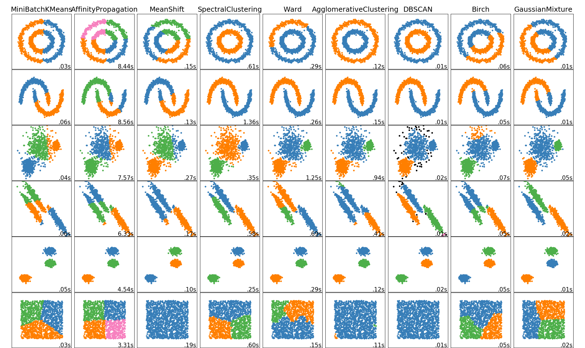
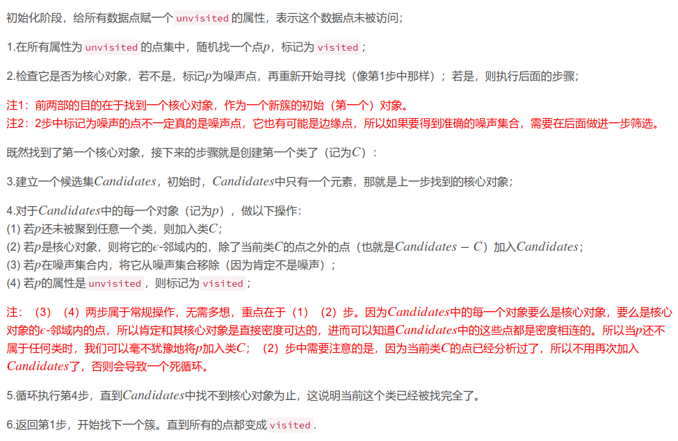
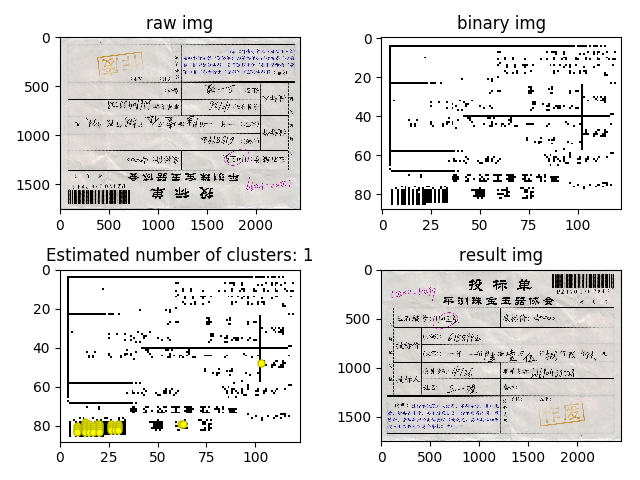

## 整体流程说明

本程序是基于基于DBSCAN算法所设计的单据检测算法，具体流程为：

0. 创建一个Dec类，并指定binaryMethod方法，默认采用Ostu
1. 从文件读取一张图片(set_img_from_file)，或则直接传入np对象(set_img_from_np)
2. 获取到图像后，类自动进行二值化计算，建议使用(Ostu)，可避免明暗不同造成差异，也可采取简单阈值(simple)
3. 基于DBSCAN算法实现聚类，然后统计固定区域聚合点数量，计算是否超过设定百分比阈值

* 当前设定下，单图2500x1500的图片大小下，单图耗时=0.1s

## 类属性方法说明

|名称|类型|参数|说明|
|:---:|:---:|:---:|:---:|
|isImgCheck|属性|bool|是否已读取文件，若False,无法后续操作|
|set_img_from_file(file)|方法|file:str|设定读取图片文件位置（与set_img_from_np(Img)二选一）|
|set_img_from_np(Img)|方法|Img:numpy|传入已加载的图片np变量（与set_img_from_file(file)二选一）|
|get_corect_img_np()|方法|None|检测和处理翻转情况，函数返回正确的Img:np变量|
|show_figure_result()|方法|None| 图片展示整体结果：左上->原图；右上->压缩且二值化图像；左下->聚合点标记；右下->调整后的图像|
|needReverse|属性|bool|记录原图是否需要翻转|

## 文件说明
> const.py： 保存可调参数文件，一般不做修改

> reverse_detection.py：时间装饰器和Dec类

## 各类聚类算法耗时分析 

## DBSCAN 算法描述

## 检测样例

