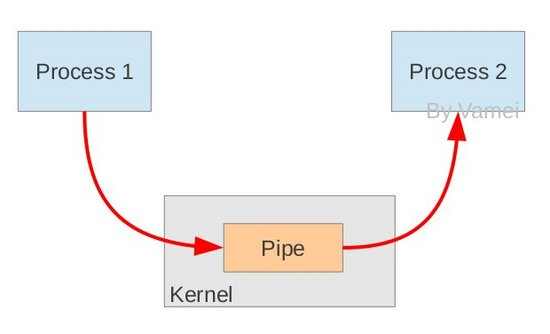
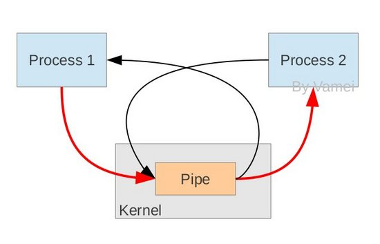

### 管道(pipe)

> 管道可用于具有亲缘关系进程间的通信，有名管道克服了管道没有名字的限制，因此，除具有管道所具有的功能外，它还允许无亲缘关系进程间的通信；

* 实现机制：

管道是由内核管理的一个缓冲区，相当于我们放入内存中的一个纸条。管道的一端连接一个进程的输出。这个进程会向管道中放入信息。管道的另一端连接一个进程的输入，这个进程取出被放入管道的信息。一个缓冲区不需要很大，它被设计成为环形的数据结构，以便管道可以被循环利用。当管道中没有信息的话，从管道中读取的进程会等待，直到另一端的进程放入信息。当管道被放满信息的时候，尝试放入信息的进程会等待，直到另一端的进程取出信息。当两个进程都终结的时候，管道也自动消失。

从原理上，管道利用fork机制建立，从而让两个进程可以连接到同一个PIPE上。最开始的时候，上面的两个箭头都连接在同一个进程Process 1上(连接在Process 1上的两个箭头)。当fork复制进程的时候，会将这两个连接也复制到新的进程(Process 2)。随后，每个进程关闭自己不需要的一个连接 (两个黑色的箭头被关闭; Process 1关闭从PIPE来的输入连接，Process 2关闭输出到PIPE的连接)，这样，剩下的红色连接就构成了如上图的PIPE。

------------
> pipe方式，读取展示145张图片

### 双进程

CPU波动图像

* 耗时:    44.2s
* CPU:    48%

### 单进程

CPU波动图像

* 耗时:   59.4s   
* CPU:  32%

------------

> queue方式，读取展示145张图片

* 耗时：47.9s
